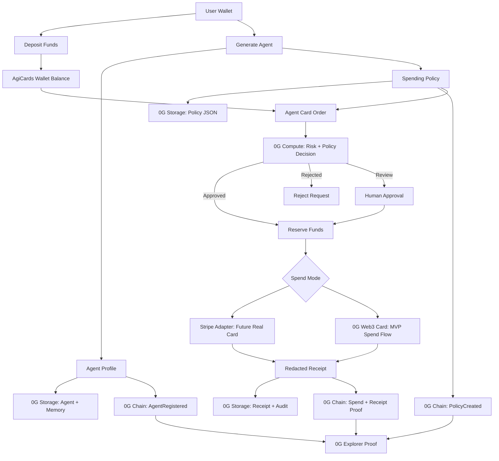

# AgiCards

[View Pitch Deck (Canva)](https://canva.link/zmsa35v5h1axhom)

AgiCards lets AI agents request controlled virtual cards, with spending policies, approvals, memory, and audit trails powered by 0G.

## Overview

AgiCards is an agent wallet and card-control layer for autonomous AI agents. Users fund a wallet, generate an AI agent, assign spending rules, and let that agent request controlled card orders or Web3 spends.

The goal is simple:

```txt
AI agents should be able to spend, but only inside user-defined rules with verifiable 0G proof.
```

## Problem

AI agents are becoming capable of taking real actions, but giving them direct spending power is risky. Users need a way to control:

- how much an agent can spend
- where an agent can spend
- when human approval is required
- how every decision and spend can be audited later

## Solution

- Users deposit funds into an AgiCards wallet before delegating spend authority.
- Users generate an agent and assign a spending policy.
- The agent creates a card order for a specific task.
- 0G Compute evaluates the request against the policy.
- AgiCards reserves funds before approval.
- The order routes to either a 0G-native Web3 card flow or a Stripe adapter.
- Receipts, policy decisions, and memory are stored and proven through 0G.

## 0G Modules Used

| Module | Use |
| --- | --- |
| 0G Chain | Smart contract proof for deposits, agents, policies, approvals, card actions, and spend receipts |
| 0G Storage | Persistent storage for agent profiles, policies, memory, decisions, and receipts |
| 0G Compute | Risk and policy evaluation through the 0G Compute Router when configured |
| Agent ID path | MVP uses contract-level agent identity, with a path to official 0G Agent ID |
| Persistent Memory path | MVP stores memory on 0G Storage, with a path to native 0G Persistent Memory |

## Demo Flow

```txt
Connect wallet
  -> Generate agent
  -> Register agent proof
  -> Deposit funds
  -> Create card order
  -> 0G Compute evaluates risk
  -> Funds are reserved
  -> Card/Web3 spend is issued
  -> Receipt and proof hashes are shown
```

## Architecture



## What This MVP Proves

- Controlled agent spending with user-defined limits.
- User deposits before any agent can spend.
- Agent and policy generation from the dashboard.
- 0G Chain proof hooks for core actions.
- 0G Storage support for policies, receipts, and memory.
- 0G Compute support for risk decisions.
- Stripe is isolated behind an adapter for future real-card support.

## Team

| Name | Role | GitHub |
| --- | --- | --- |
| varl999 | Builder — full-stack, smart contract, 0G integration | [@Jennivarl](https://github.com/Jennivarl) |
| Mustapha Abdulaziz | Smart Contract Auditor — security review, audit report | [@mustaphaabdulazizdambatta](https://github.com/mustaphaabdulazizdambatta) |

## Reviewer Notes

The live MVP is deployed at **https://agicards.dev** — no local setup required to evaluate the product.

The 0G Layer page at **https://agicards.dev/app/proof** contains all verifiable proof in one place:
- Deployed contract address with 0G Explorer link
- All five 0G Storage roots from a real proof run
- Compute decision root confirming a live policy evaluation

To test locally with live 0G modules, you will need:
- `OG_STORAGE_PRIVATE_KEY` — funded on 0G Mainnet for storage uploads (get A0GI from the [0G faucet](https://faucet.0g.ai))
- `OG_COMPUTE_API_KEY` — from the 0G Compute Router for AI policy evaluation
- `DEPLOYER_PRIVATE_KEY` — for redeploying the contract to 0G Mainnet

Without these, the app runs in fallback mode: mock Merkle roots for storage, deterministic policy engine for compute. All UI flows still work.

## Local Development

```bash
npm install
npm run dev
```

Then open `http://localhost:3000`.

## Checks

```bash
npm run test
npm run typecheck
npm run compile:contract
npm run build
```

Or run the core non-build checks together:

```bash
npm run verify
```

GitHub Actions runs `npm run verify` and `npm run build` on pushes and pull requests.

## Contract Compile And Deploy

```bash
npm run compile:contract
npm run deploy:0g
```

See [docs/DEPLOYMENT.md](docs/DEPLOYMENT.md) for the 0G Mainnet deployment flow.

Use `/api/integrations/status` locally to see which live-mode environment variables are still missing.

## 0G Integration

The deployed contract is `contracts/AgiCardsRegistry.sol` on 0G Mainnet (Chain ID 16661).

For local development, storage returns mock Merkle roots unless `OG_STORAGE_PRIVATE_KEY` or `DEPLOYER_PRIVATE_KEY` is set. When configured, the storage adapter uploads JSON payloads to 0G Storage with the official TypeScript SDK.

For local development, compute uses the deterministic policy engine unless `OG_COMPUTE_API_KEY` is set. When configured, the compute adapter calls the 0G Compute Router OpenAI-compatible `/chat/completions` endpoint. The default model is `OGM-1.0-35B-A3B`, with `deepseek-v4-pro` as the premium fallback model.

The submission includes:

- 0G Mainnet contract address
- 0G Explorer link showing verifiable on-chain activity
- 0G Storage roots for policies, memory, and receipts
- Demo video showing the full user deposit -> agent request -> approval -> spend proof flow

## Deployment Proof

| Item | Value |
| --- | --- |
| 0G Contract Address | 0xc757698204543af249e328764e89530464de668e |
| 0G Explorer Link | https://chainscan.0g.ai/address/0xc757698204543af249e328764e89530464de668e |
| Deployment Transaction | https://chainscan.0g.ai/tx/0xb9e73926ec6a01df223b84a98a718022955838d09f7257da05cc76fb00fdc8b9 |
| Agent Profile Root | 0xa9639b81ba042c45c8ba6d13b73a53110fc83be9e3067123cf933f7bd4de5140 |
| Policy Root | 0xa9b39fc3e22c39058822aeee69800eeb6bfc83c5ca2b95201611886e8a6c1b1e |
| Receipt Root | 0x5e8041c243afa263814d01c01c776876056d0369dae358f413c787c6e4dfa752 |
| Compute Decision Root | 0xa12eb9cfe85854f721aeaf36230a7d562bc376b9635fe2bddf490f40dad7773f |
| Memory Root | 0xf599f6a4430673f2ecc201e0216248f3ae540d0991d8a0ae3bee31181d331e6b |

## Repository Structure

```txt
app/                    Next.js dashboard and API routes
contracts/              0G Chain proof registry
docs/                   architecture and submission notes
lib/adapters/           0G, Stripe, and Web3 card adapters
lib/policyEngine.ts     funding, limit, and approval checks
```

See [docs/DEMO_SCRIPT.md](docs/DEMO_SCRIPT.md) for the 3-minute hackathon demo flow.
See [docs/ARCHITECTURE_DIAGRAM.md](docs/ARCHITECTURE_DIAGRAM.md) for the system diagram.

## User Deposit Layer

AgiCards requires users to deposit funds before agents can request cards. The wallet tracks deposited, reserved, spent, and available balances. Every card request reserves funds first; rejected requests release funds, and completed spends reduce the user's available balance.

## Two Spend Paths — One Proof Layer

AgiCards is a hybrid. The Web3 card path is live today — enforced entirely on-chain with full 0G proof. The Stripe adapter is architected and ready for when issuer-backed real cards are needed in supported jurisdictions. Both paths sit behind the same smart contract policy engine and produce the same verifiable proof trail. On-chain enforcement and traditional payment rails working together, not competing.
