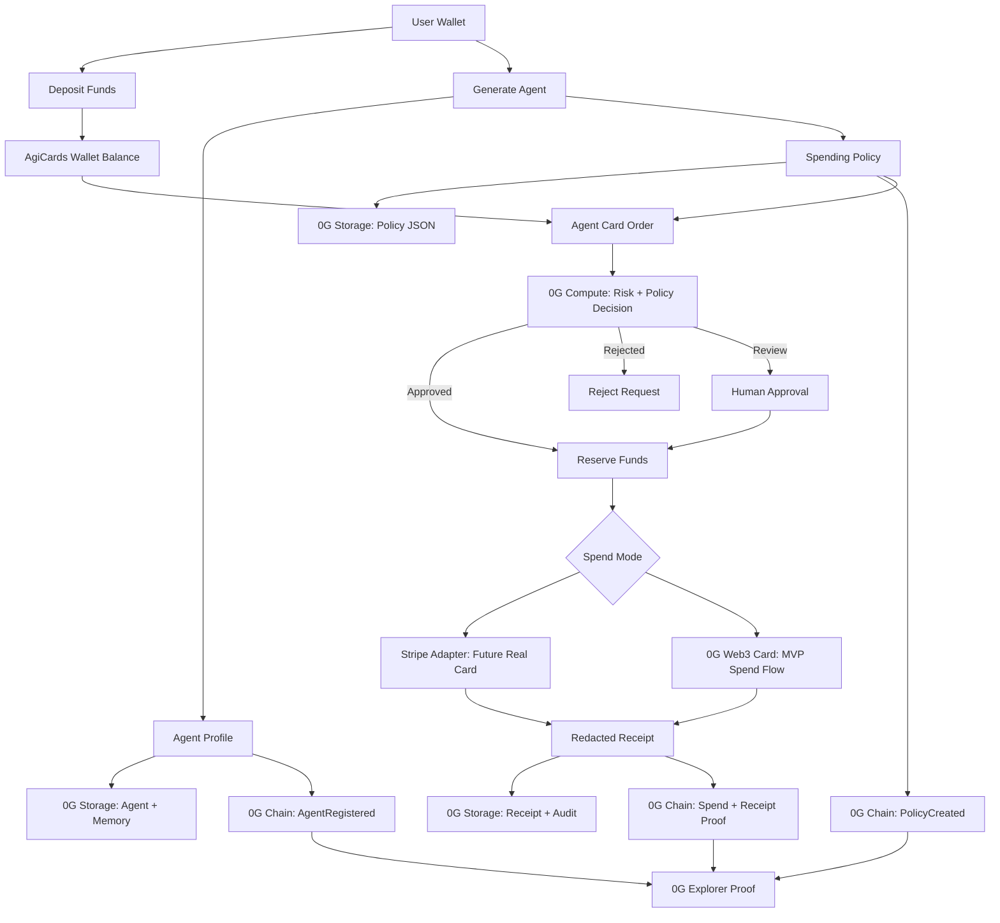

# Architecture Diagram

## Plain English

AgiCards has two spending paths:

- Stripe adapter for future real-card issuing where supported.
- 0G-native Web3 card flow for the working hackathon MVP.

0G is used for:

- Chain proof of agents, policies, deposits, approvals, and spends.
- Storage of policies, receipts, memory, and audit records.
- Compute-based risk and policy evaluation.

